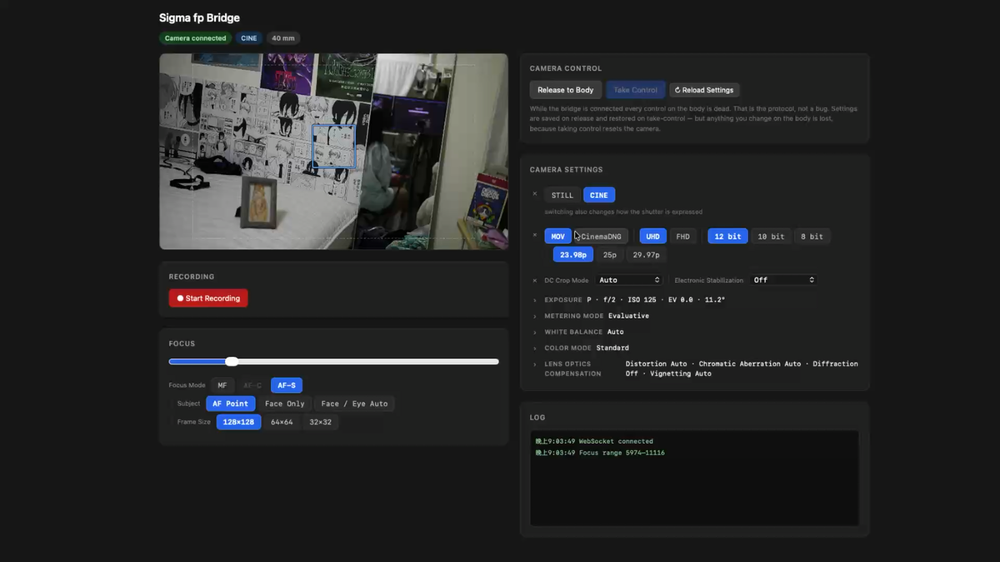

# sigma-fp-bridge

Camera control for **Sigma fp** over USB, via the vendor's PTP protocol. Focus,
exposure, movie settings, recording, tethered capture and pulling footage back —
exposed over HTTP and WebSocket so anything can drive the camera.

Started as focus control alone, which is where the lens motor part comes from:
it drives the lens's internal motor directly, with no external follow-focus rig.
The name changed when the rest outgrew it; the git history still says
`sigma-fp-focus-bridge` and that is deliberate — the record of what was tried,
got wrong and corrected is a large part of what this repo is worth.



<!-- The walkthrough video is attached to the repo rather than committed: GitHub
     only plays video it hosts itself, so a file in the tree would render as a
     link, not a player. Drag the .mov into a release or a comment and paste the
     resulting URL here. -->

> **🤖 Built by pair-programming with [openclaw](https://github.com/openclaw)**, an AI agent harness.
> Most of the protocol reverse-engineering and library patching in this repo came from a Claude-driven agent stepping through PTP details much faster than I could solo.

---

## What this is

A Python bridge server that talks to Sigma fp over USB PTP and exposes:

- **WebSocket API** for real-time focus control (`set_position`, `get_state`)
- **REST API** for one-shot HTTP commands — settings, recording, capture, download
- **MJPEG live view stream** browsers / OpenCV / OBS can consume
- **Bonjour / mDNS broadcast** so iOS clients can auto-discover the bridge
- **Browser UI** with live preview, focus control, exposure and movie settings,
  and recording
- **Tethered capture** — JPEG, DNG or both, straight to disk
- **Movie download** over USB at around 56 MB/s
- **A raw PTP probe** for carrying on the reverse engineering

You point your camera at something, slide a number on the screen, and the lens motor moves to that position.

## Why this exists

Almost every "follow focus" solution for fp uses an external motor clamped on the focus ring (DJI Focus Pro, Tilta Nucleus, PDMovie). This works directly through the **lens's internal stepper / linear actuator** over USB — no rigging, no mechanical interface.

Useful for:
- DIY autofocus assist rigs (LiDAR / face tracking driving focus)
- Timelapse with programmed focus pulls
- Bullet-time or motion-control setups
- Anyone allergic to strapping motors onto their lens

## Status

| Component | Status |
|---|---|
| Mac bridge (Python) | ✅ Working |
| Browser UI | ✅ Working |
| Exposure / white balance / format control | ✅ Working |
| Movie settings (shutter angle, frame rate, CinemaDNG) | ✅ Working |
| Recording start / stop | ✅ Working |
| Tethered capture (JPEG / DNG / both) | ✅ Working |
| Movie download over USB | ✅ Working |
| WebSocket + REST + MJPEG | ✅ Working |
| Bonjour mDNS | ✅ Working |
| iOS app | ❌ Not yet |
| Linux / Windows bridge | ⚠ Should work, not tested |

## Tested with

- **Camera**: Sigma fp, firmware **Ver. 5.02** (latest, 2023-08-03)
- **Lens**: **Sigma 28mm F1.4 DG DN | Art** (HLA motor) — confirmed
- **Host**: macOS Sequoia 15.x, Apple Silicon, Python 3.9

If you test other configurations, please open an issue or PR.

---

## Quickstart (macOS)

There are two ways to run it, and they are separate things:

| | What it runs | Needs |
|---|---|---|
| `sudo ./run_mac.sh` | the source tree | git, python3, a venv, network for deps |
| `sudo ./dist/sigma-fp-bridge` | a single built binary | nothing else |

Both need `sudo`, and that has nothing to do with which one you pick: claiming
the camera away from macOS's own `ptpcamerad` requires root either way.

`run_mac.sh` never runs the built binary — it always executes
`mac_bridge_server.py` from the tree, so it is what you want while changing the
code. Building is covered under [A single-file build](#a-single-file-build).

### 1. Prerequisites

```bash
xcode-select --install  # for git + system python3
```

**Homebrew is not required.** `requirements.txt` pulls in
[`libusb-package`](https://pypi.org/project/libusb-package/), which bundles a
libusb binary; the bridge falls back to it whenever the system libusb isn't
found. `brew install libusb` still works if you prefer a system one.

> This fallback matters more than it looks: **`sudo` strips `DYLD_*` environment
> variables**, so the `DYLD_FALLBACK_LIBRARY_PATH` that `run_mac.sh` exports to
> locate a Homebrew libusb is silently discarded under root — and root is exactly
> what you need to claim the camera. The bundled library is loaded by absolute
> path, so it survives.

### 2. Clone + setup

```bash
git clone https://github.com/<you>/sigma-fp-bridge.git
cd sigma-fp-bridge
python3 -m venv .venv
.venv/bin/pip install -r requirements.txt
```

`requirements.txt` includes [sigma-ptpy from git](https://github.com/makanikai/sigma-ptpy) because the PyPI version is too old.

### 3. Camera setup

- Power on, USB-C to your Mac
- **Menu → SYSTEM → USB Mode → PTP** (not Mass Storage, not Webcam)
- **Menu → Custom Settings → Linear Focus → ON**
- Set the camera to **CINE** (movie) mode
- **Lens physical AF/MF switch → AF** (counter-intuitive, see below)

### 4. Run as root

macOS binds PTP-class cameras to `ptpcamerad` at USB enumeration. Detaching that
binding uses IOKit's device-capture API, **which requires root** — so just run
with `sudo`:

```bash
sudo ./run_mac.sh
```

That's it. The system daemons keep running; Photos, Image Capture, and iPhone
backup all keep working. If root still can't claim the device, see
[Gotcha 5](#gotcha-5-macos-binds-ptp-cameras-at-enumeration) for the fallback.

### 5. Verify

```bash
sudo .venv/bin/python sigma_fp_focus.py --dump-info5
```

Read-only — it never drives the motor. Prints the mounted lens, current focus
state, and the focus position range. Good first check that everything is wired
up before starting the bridge.

Then start the bridge. You should see:

```
INFO sigma-bridge | 相機已連線
INFO sigma-bridge | 瀏覽器測試: http://192.168.x.x:1025/
```

Open `http://localhost:1025/` and drag the focus slider. The lens should move in real-time.

Nothing to undo afterwards — no system state was changed.

### A single-file build

If you would rather not carry a virtualenv around:

```bash
.venv/bin/python -m pip install pyinstaller
.venv/bin/python -m PyInstaller sigma-fp-bridge.spec
sudo ./dist/sigma-fp-bridge
```

`static/` is declared in the spec because the page is read from disk and so is
invisible to the import graph. libusb needs no special handling: `libusb-package`
ships a PyInstaller hook, and it is already a dependency for the reason described
under [The five gotchas](#the-five-gotchas) — under `sudo`, macOS strips `DYLD_*`
and the Homebrew copy of libusb stops being findable.

---

## The five gotchas

Things that cost hours to figure out. Sharing so you don't have to repeat them.

### Gotcha 1: SDK doc tags are decimal, NOT hex

The official SDK doc lists `DataGroupFocus` tags as:

```
0001 Focus Mode
0002 AF Lock
0010 Focus Area
0080 Focus State (Read-Only)
0081 Focus Position
```

These look like 4-digit hex codes. **They are not.** They're decimal numbers with leading zeros for visual alignment.

- `0081` = decimal `81` (= `0x51` hex)
- **NOT** `0x81` hex (= decimal `129`)

I lost about two hours sending Tag 129 and wondering why the camera ignored every command.

### Gotcha 2: Linear Focus must be enabled

Without **Menu → Custom Settings → Linear Focus → ON**, the lens motor silently ignores PTP focus commands. The camera replies "OK", but nothing moves.

Linear Focus was originally a video shooter setting (consistent focus pull speed regardless of ring rotation speed). It also turns out to be the master gate for accepting electronic focus position commands.

### Gotcha 3: Lens physical AF/MF switch must be on AF

This one is genuinely backwards from intuition:

- **Lens switch on AF**: PTP commands work. Camera body controls focus, you can override programmatically (set FocusMode=MF via PTP, then set FocusPosition).
- **Lens switch on MF**: PTP commands silently ignored. The lens treats the physical ring as the only valid input.

So: leave the physical switch on **AF** at all times, and let PTP handle the "MF" mode switching in software.

### Gotcha 4: the camera body locks up while the bridge is connected

This one is by design, and it surprises everyone. From Sigma's own SDK
documentation for `sgm_ConfigApi` — the first command any API client must send:

> When this function is executed, API resets the camera setting to the default.
> (When API connection is closed, the camera setting returns to the setting value
> which the user specified before using API.) **Furthermore, API does not accept
> any operation other than the power-off operation.**

So while the bridge holds the camera, **every physical control on the body stops
responding** — dials, buttons, touchscreen, the lot. Only the power switch works.
There is no way around this: it's the cost of entering API control mode, not
something the bridge chooses.

Two consequences worth internalising:

- **Your camera settings are reset to defaults** on connect, and only restored
  when the API connection is closed *properly*.
- **Closing the PTP session is not enough.** The camera leaves API mode on
  `sgm_CloseApplication` (or a USB disconnect). `close_camera()` sends it before
  closing the session — if you write your own client, don't skip it, or the only
  way to get the body back is unplugging the cable or power-cycling.

Shut the bridge down with Ctrl+C and control returns cleanly. To get the body
back **without** stopping the bridge, use `release` (WebSocket) or
`POST /api/release`, then `acquire` when you want control again. While released
there is no live view, no status polling and no focus control — the bridge is
genuinely off the camera.

`release` sends `sgm_CloseApplication` but **keeps the USB interface claimed**.
Letting go of it means macOS rebinds the camera to `ptpcamerad` within moments,
and this process cannot get it back — eight consecutive re-acquires failed with
the camera plainly visible on the bus. Holding the claim also makes re-acquiring
a single `sgm_ConfigApi` instead of a fresh USB fight.

Re-acquiring runs `sgm_ConfigApi` again, which resets the camera to defaults, so
`release` snapshots the settings and `acquire` restores them. Without that,
stepping away to press a button on the body would silently cost you every setting
you had dialled in.

**A consequence worth knowing:** changes you make on the body while released do
not survive re-acquiring — the reset discards them, and the restore then puts
back what was there before. Pass `restore: false` (WebSocket) or
`POST /api/acquire?restore=0` to keep the reset values instead.

### Gotcha 5: macOS binds PTP cameras at enumeration

When you plug in any PTP-class USB camera, macOS binds it to system daemons that
claim the device's IOKit interface:

- `/usr/libexec/ptpcamerad`
- `/usr/libexec/cameracaptured`
- `mscamerad-xpc` (Image Capture XPC service)

While they hold the device, an unprivileged `libusb_detach_kernel_driver()` fails
and the bridge can't acquire the camera.

**The fix is just `sudo`.** On macOS, libusb implements detach via IOKit's device
capture API (`USBDeviceReEnumerate` with the capture mask), and **that API
requires root**. An unprivileged detach failing is expected behaviour, not macOS
blocking you. Verified on macOS Sequoia with all three daemons running normally
(libusb 1.0.30) — root claimed the camera without touching them.

Two things that do *not* work, in case you're tempted:

1. **`launchctl disable` doesn't stick** on SIP-enabled macOS for these services.
2. **`killall ptpcamerad` doesn't help** — launchd respawns it instantly on the
   next USB hotplug.

<details>
<summary>Fallback: pausing the daemons (only if root still fails)</summary>

`SIGSTOP` works where `killall` doesn't — pausing leaves launchd thinking the
process is alive (so no respawn), but a paused process can't claim USB.

```bash
sudo killall -STOP ptpcamerad cameracaptured mscamerad-xpc
```

**Run this BEFORE plugging in the camera**, or unplug-replug afterwards — the
IOKit binding happens during USB enumeration.

> 🚨 **This pollutes your macOS environment.** While the daemons are stopped,
> Photos / Image Capture / Finder / iCloud import all stop recognizing your
> camera, and iPhone backup over USB breaks. Always restore with
> `sudo killall -CONT ptpcamerad cameracaptured mscamerad-xpc` when you finish.

</details>

---

## sigma-ptpy patches

[`sigma-ptpy`](https://github.com/makanikai/sigma-ptpy) is a great library but was written against pre-v3.00 SDK and doesn't support the new focus tags. We monkey-patch it.

### Add `FocusPosition` (Tag 81) + `FocusState` (Tag 80)

```python
import sigma_ptpy.sigma_ptpy as _sigma_ptpy_module
import sigma_ptpy.schema as _sigma_schema_module
from sigma_ptpy.schema import CamDataGroupFocus, DirectoryType

class CamDataGroupFocusExt(CamDataGroupFocus):
    def __init__(self, FocusPosition=None, FocusState=None, **kwargs):
        super().__init__(**kwargs)
        self.FocusPosition = FocusPosition
        self.FocusState = FocusState

    def encode(self):
        data = []
        # ... copy the parent's existing tag encoding ...
        if self.FocusPosition is not None:
            # Tag 81 (decimal), Type UInt16, Count 1
            data.append((81, DirectoryType.UInt16, self.FocusPosition))
        return self._encode(data)

    def decode(self, rawdata):
        super().decode(rawdata)
        for tag, val in self._decode(rawdata):
            if tag == 80:
                self.FocusState = val[0]
            elif tag == 81:
                self.FocusPosition = val[0]

# Replace in the module so cam.get_cam_data_group_focus() returns the Ext class
_sigma_ptpy_module.CamDataGroupFocus = CamDataGroupFocusExt
_sigma_schema_module.CamDataGroupFocus = CamDataGroupFocusExt
```

Full version with proper logging and error handling in [`sigma_fp_focus.py`](./sigma_fp_focus.py).

### Use it

```python
from sigma_ptpy import SigmaPTPy
# (after patch is installed)

cam = SigmaPTPy()
with cam.session():
    cam.config_api()
    focus = CamDataGroupFocusExt(
        FocusMode=FocusMode.MF,
        AFLock=AFLock.Off,
        PreConstAF=PreConstAF.Off,
        FocusPosition=1500,  # tweak per lens; see below
    )
    cam.set_cam_data_group_focus(focus)
    # Lens motor starts moving.

    state = cam.get_cam_data_group_focus()
    print(state.FocusPosition, state.FocusState)  # current pos, 0=Idle 1=Moving
```

### Focus position range — `CanSetInfo5` tag 658

Valid `FocusPosition` values differ per lens and per zoom position. The camera
reports the range in `CanSetInfo5`, but sigma-ptpy only decodes the tags it
already knows about and discards the raw payload — so we patch `decode()` to
keep the bytes and parse them ourselves (`ifd.py`).

```bash
sudo .venv/bin/python sigma_fp_focus.py --dump-info5
```

Read-only; it never drives the motor. Prints the mounted lens and current focus
state, then a hex dump and every directory entry, with tags in **both decimal and
hex** so you can cross-reference the SDK PDF either way.

**The tag is decimal `658`** — [Gotcha 1](#gotcha-1-sdk-doc-tags-are-decimal-not-hex)
again. The SDK doc writes it `0658`; hex `0x658` (= 1624) does not exist in the
payload. Two `UInt16`s, `(min, max)`. This matches how every other range in
`CanSetInfo5` is encoded — e.g. tag 340 is `(-50/10, 50/10, 2/10)`, i.e.
exposure compensation −5.0…+5.0 in 0.2 steps.

`get_focus_range(cam)` returns `(min, max)` and cross-checks the current position
against it.

**Measured ranges — please add yours:**

| Lens | Reported focal length | Focus position range |
|---|---|---|
| (unidentified, needs confirming) | 40.0 mm | 5974 – 11116 |

Confirmed on that lens by parking focus at the end of travel and reading back
`FocusPosition` — it returned exactly `11116`, the reported maximum.

If you run the dump, please open an issue with the output. The header block
identifies which lens the numbers belong to, so the whole dump is
self-describing.

---

## Lens compatibility (help wanted)

Sigma's official SDK supports Focus Position in principle, but the actual lens motor's response varies. Help us build the compatibility list.

| Lens | PTP Focus Position | Notes |
|---|---|---|
| Sigma 28mm F1.4 DG DN Art | ✅ Working | HLA motor |
| Sigma 17mm F4 DG DN Contemporary | ❓ Uncertain | May depend on AF/MF switch state |
| Unidentified, reports 40.0 mm | ✅ Reports range | 5974 – 11116; motor drive not yet retested |

**If you have an L-mount AF lens, please test and PR your result.**

Quick test:
1. Set up as in Quickstart
2. Open the browser UI
3. Set focus position to various values
4. Check whether the lens motor physically moves AND whether `Focus State` shows `1 (Moving)` then `0 (Idle)`

---

## Architecture

```
                    Mac running this bridge
        ┌─────────────────────────────────────────┐
        │  Python (aiohttp)                       │
        │  ├─ sigma-ptpy + monkey-patch           │
        │  ├─ camera worker (priority queue)      │
        │  ├─ WebSocket /ws    (real-time control)│
        │  ├─ REST /api/*      (one-shot HTTP)    │
        │  ├─ MJPEG /liveview.mjpeg (live view)   │
        │  ├─ Bonjour _sigmafp._tcp               │
        └──────────────┬──────────────────────────┘
                       │ USB-C (PTP, opcodes 0x9012-0x9037)
                       ▼
                   Sigma fp
                       ▲
                       │ Wi-Fi / local network
        ┌──────────────┴──────────────────────────┐
        │  Clients                                │
        │  - Browser at http://host:1025/         │
        │  - Future: iOS app via Bonjour          │
        │  - Anything that speaks WebSocket / HTTP│
        └─────────────────────────────────────────┘
```

### Camera worker

USB PTP runs one transaction at a time, so camera access has to be serialized.
A single worker task owns the camera; everything else submits jobs to a priority
queue — **control > status > live view**. This matters because a plain lock is
first-come-first-served, which puts your focus command behind however many live
view frame requests happen to be queued.

Three consequences worth knowing:

- **Focus commands preempt live view.** Frame grabs never delay a focus move.
- **Rapid setpoints coalesce.** Drag a slider (or drive focus from ARKit at 30 Hz)
  and only the newest position is sent; the superseded ones are dropped before
  they reach USB. Focus position is absolute state, not an increment, so this is
  lossless in the sense that matters. Responses carry `"applied": false` when a
  command was superseded.
- **Live view is fanned out, not per-client.** One producer grabs each frame and
  publishes it to every MJPEG client. Two browser tabs cost one frame grab, not
  two. Clients that can't keep up skip to the newest frame instead of applying
  backpressure to the camera.

## File layout

```
.
├── sigma_fp_focus.py       Low-level: sigma-ptpy patch + helpers
├── mac_bridge_server.py    HTTP / WebSocket / MJPEG server
├── ifd.py                  Sigma PTP IFD parser (no sigma-ptpy dependency)
├── static/
│   └── index.html          Browser test UI
├── debug_encode.py         Standalone IFD encoder sanity test
├── diagnose.py             Dump all camera state for troubleshooting
├── tests/                  Runs against a fake camera — no hardware needed
├── run_mac.sh              One-shot launcher (auto-creates venv)
├── requirements.txt
└── README.md
```

### Tests

```bash
python3 tests/test_ifd.py       # IFD parser, pure data
python3 tests/test_bridge.py    # camera worker + HTTP/WS/MJPEG, fake camera
python3 tests/test_session.py   # camera session lifecycle
python3 tests/test_settings.py  # settings encode/decode, batch apply
python3 tests/test_movie.py     # movie data group, recording probe
python3 tests/test_ui.py        # browser UI: syntax, wiring, render discipline
```

Both run without a Sigma fp attached. `tests/test_bridge.py` pins the properties
that concurrency bugs quietly break: focus commands preempting queued live view
frames, rapid setpoints coalescing into one USB write, MJPEG clients sharing one
frame stream, and live view surviving a motor-settle wait.

## API reference

### WebSocket (`/ws`)

```javascript
ws.send(JSON.stringify({cmd: "set_position", position: 1500}));
ws.send(JSON.stringify({cmd: "get_state"}));
ws.send(JSON.stringify({cmd: "set_active_lens", lens_id: "28mm_art"}));

// Camera settings
ws.send(JSON.stringify({cmd: "describe_settings"}));   // choices for every setting
ws.send(JSON.stringify({cmd: "get_settings"}));
ws.send(JSON.stringify({cmd: "set_settings", settings: {aperture: 2.8, iso: 800}}));

// Hand the body back / take it again (see Gotcha 4)
ws.send(JSON.stringify({cmd: "release"}));
ws.send(JSON.stringify({cmd: "acquire"}));
```

`describe_settings`, `release` and `acquire` work even with no camera attached;
everything else requires a connection.

Server pushes a `state` message at ~10 Hz with current focus position / state /
mode, plus `focus_range` — the `(min, max)` the camera reports for the mounted
lens, or `null` if it doesn't report one. The `hello` message carries it too, so
a client knows the valid bounds before the first state push.

Positions outside the range are clamped to the nearest bound rather than sent to
the camera. Acks report what happened:

```json
{"type": "ack", "requested": 100, "position": 5974, "applied": true, "clamped": true}
```

`applied: false` means the command was superseded by a newer one before it
reached USB (see [camera worker](#camera-worker)).

### REST

```bash
curl http://localhost:1025/api/status
curl -X POST http://localhost:1025/api/focus  -d '{"position":1500}' -H "Content-Type: application/json"
curl -X POST http://localhost:1025/api/distance -d '{"distance":2.5}' -H "Content-Type: application/json"

# Camera settings
curl http://localhost:1025/api/settings/schema   # what's settable, with choices
curl http://localhost:1025/api/settings
curl -X POST http://localhost:1025/api/settings -H 'Content-Type: application/json' \
  -d '{"aperture": 2.8, "iso": 800, "exposure_mode": "Manual"}'

# Hand the body back without stopping the bridge (see Gotcha 4)
curl -X POST http://localhost:1025/api/release
curl -X POST http://localhost:1025/api/acquire
```

### Camera settings

Exposure, white balance and image format are exposed in human units — the
protocol's 8-bit APEX codes are converted for you (`aperture: 2.8`, not `32`).
`GET /api/settings/schema` lists every setting with its allowed values, so a UI
can build itself.

**The allowed values come from the camera, not from a static table.** The APEX
conversion tables span far more than any real body accepts — ISO 6 to 102400 —
while an fp reports ISO 100–25600. `CanSetInfo5` carries the real limits as
fixed-point values scaled by 256:

| tag | meaning | example (fp, 40mm lens) |
|---|---|---|
| 215 | ISO range (APEX Sv, `Sv 5 = ISO 100`) | `(5.0, 13.0, 1.0, 0.33)` → ISO 100–25600, ⅓ stop |
| 216 | Auto ISO range | `(5.0, 11.0, …)` → ISO 100–6400 |
| 217 | Exposure compensation range (EV) | `(-5.0, 5.0, 0.33)` → ±5 EV, ⅓ stop |
| 658 | Focus position range | `(5974, 11116)` |

Values outside the reported range are rejected with an explanatory error rather
than sent and silently ignored by the camera. The ranges are re-read whenever the
lens or focal length changes.

Changes are validated as a batch before anything is sent: one bad value rejects
the whole request rather than leaving the camera half-configured. Settings that
share a `DataGroup` are written in a single transaction.

**Every write is read back and verified.** A PTP write returns OK even when the
camera then ignores the value, which is the worst kind of failure to debug — the
UI shows what you asked for and the camera does something else. Responses carry a
`rejected` map naming anything that did not stick:

```json
{"rejected": {"shutter_speed": {"requested": 0.002, "actual": 0.04,
  "hint": "exposure mode is AperturePriority; auto exposure overrides a manual shutter"}}}
```

That hint matters. Manual exposure values behave exactly like focus position: in
P or A mode the camera's auto-exposure overwrites your shutter the instant after
you set it, the same way auto-focus reclaims a focus position unless `AFLock` and
`PreConstAF` are switched off in the same write. Set `exposure_mode` to `Manual`
first.

| Settable | |
|---|---|
| Exposure | `exposure_mode` (P/A/S/M), `aperture`, `shutter_speed`, `iso`, `iso_auto`, `exposure_compensation`, `metering_mode` |
| White balance | `white_balance`, `color_temp` (Kelvin; needs `white_balance: ColorTemp`) |
| Format | `image_quality` (DNG/JPEG), `dng_quality` (12/14-bit), `resolution`, `aspect_ratio` |
| Look | `color_mode`, `color_space`, `tone_effect` |
| Drive | `drive_mode` |
| Cinema | `shutter_angle` (needs a frame rate — see below) |

#### Shutter angle

Cinema work thinks in shutter angle, not seconds: 180° means the exposure covers
half of each frame, which keeps motion blur consistent across frame rates.

    angle = 360 × exposure_seconds × frame_rate

There is no writable shutter-angle field in the protocol — `CanSetInfo5` tag 214
`ShutterAngle` is a capability report only — so the bridge converts the angle to
a shutter time and writes the ordinary `shutter_speed` field. Identical result
for the camera, familiar units for you.

Set the frame rate first (`set_frame_rate` over WebSocket, or the fps box in the
UI). An angle without a frame rate is meaningless and is rejected rather than
guessed at.

**Shutter speeds are discrete, so not every angle is reachable.** The response
always reports the angle you actually got:

| Requested | Frame rate | Actual |
|---|---|---|
| 180° | 24 fps | **172.8°** (1/50s — 1/48 isn't on the ⅓-stop scale) |
| 180° | 25 fps | 180.0° (1/50s) |
| 180° | 30 fps | 180.0° (1/60s) |

`shutter_angle` and `shutter_speed` are two views of one setting, so sending both
in the same request is rejected.

**Not settable over PTP:**

- ~~Still ↔ movie mode~~ — **this turned out to be writable.** See
  `capture_mode` below. The SDK says the setting "is synchronized with the switch
  status", which I read as "only the switch can change it". It is not: writing
  `DataGroupMovie` tag 1 switches the body, confirmed by watching the screen.
#### Stills and movie are different cameras

The body switch does not merely change what gets recorded — **it changes which
settings exist and what values they accept.** Ignoring that is how you end up
writing a value the camera accepts and discards.

| | STILL | CINE |
|---|---|---|
| `RecordFormat`, `CinemaDNGImageQuality`, `MovieResolution`, `ShutterAngle` | no legal values | populated |
| `ImageQuality`, `DNGQuality`, `StillImageResolution`, `DriveMode` | populated | populated but inert |
| Exposure compensation | ±5 EV | ±3 EV |
| Shutter | full APEX range | capped at 1/25 by frame rate |

`camera_mode` in the status and schema responses reports which side you are on,
and `/api/settings/schema` lists only the settings that apply. Writing one that
does not is refused with the alternative named — `shutter_speed` in CINE points
you at `shutter_angle` — rather than being sent and silently dropped.

The switch position has no directly readable field. `CanSetInfo5` tag 100
`StillMovieSwitch` returns `[1, 1]`, which appears to mean "both supported"
rather than "currently here". The mode is inferred from whether the movie
capability lists carry any values, which tracks the switch exactly in testing.

#### Movie mode (CINE)

With the body switch on CINE, **exposure is governed by `DataGroupMovie`, not
`DataGroup1`.** Writing `shutter_speed` there is accepted and discarded — the
value simply never changes. Use `shutter_angle`, which writes to the movie group.

| Setting | |
|---|---|
| `shutter_angle` | 11.2 – 360°, from the camera's own list |
| `frame_rate` | 23.98 / 25 / 29.97 |
| `cinema_dng_quality` | 12 / 10 / 8-bit |
| `record_format`, `movie_resolution` | camera-reported values, labelled |
| `mov_image_quality` | reported but **never settable in testing** — see below |

**`record_format`: 1 = CinemaDNG, 2 = MOV.** Established by recording a clip at
each setting on a freshly cleared card and looking at what came out — the fp does
not show the format on its main display, and the protocol reports a bare number.
`movie_resolution` 1 = FHD, 2 = UHD — 2 from that clip, 1 confirmed by
inspecting the recorded file. Values that have not been confirmed this way are
left unlabelled rather than guessed at.

`mov_image_quality` reads back as 1 or 2 and neither value has a meaning
established. The method that identified `record_format` — set each value, record
a clip, look at what came out — could not be run: the camera reported no settable
values for it in MOV and CinemaDNG, at UHD and FHD, and at 23.98, 29.97 and
59.94 fps. Whatever gates it was not found. It is hidden from the UI — a control that cannot be
changed and whose values mean nothing to the reader is just clutter — but the
protocol mapping and API access stay, so anyone who works out what gates it can
pick up where this left off.

**Two frame rates do not take, and the camera is what rounds them.** Writing
29.97 stores 30 and 59.94 stores 60, while 23.98, 25 and 50 are stored as asked —
even though the camera lists 29.97 and 59.94 as legal and does not list 30 or 60
at all.

This was carried as unexplained for a long time, on the assumption that the
encoding might be at fault. It is not. Writing `tag 61` directly, bypassing every
layer of this project, gives the same result for `(2997, 100)` and for the exact
NTSC ratio `(30000, 1001)`: both read back `(3000, 100)`. `(5994, 100)` reads back
`(6000, 100)`, and `(2398, 100)` reads back unchanged.

So the rounding is in the firmware, and probably only in the label. A 23.98 take
carries `mvhd` timescale 24000, i.e. 24000/1001 — the camera works in NTSC
denominators internally. A take at the reported "30" would most likely show
timescale 30000 with 1001-tick samples, which is 29.97. Confirming that needs a
recording downloaded and its sample deltas read.

**Still/movie mode is `DataGroupMovie` tag 1** — 1 for STILL, 2 for CINE. Writing
it switches the body: the screen changes, and the whole capability set swaps over
(drive mode, continuous shooting, interval timer, aspect ratio, fill light and HDR
appear; audio, record format, CinemaDNG depth, resolution, frame rate, aperture,
T-stop, shutter and shutter angle disappear). Switching also drags the shutter
unit along with it.

This corrects the earlier claim that the mode could only be changed on the body.
It also means the bridge reads the mode rather than inferring it from which
capabilities are populated, which is what it did before.

**The shutter unit is `DataGroupMovie` tag 6** — 1 for speed, 2 for angle. Found
by writing to it: at 2 the camera declares 18 legal shutter angles, at 1 it
declares none while still reporting a shutter speed range. This is why writing
`shutter_speed` in CINE appeared to do nothing — the camera was in angle mode,
and the field it accepts depends on this tag. Confirmed by switching to 1 and writing 1/500, 1/50 and 1/125 — all three
read back exactly. The UI's seconds/angle buttons set the tag, so switching
there switches the camera, and the schema lists only the representation
currently in effect.

Both read-only routes to identifying it were closed: a change made on the body is
wiped by `sgm_ConfigApi` on re-acquire, and outside API mode the camera answers
vendor commands with an empty payload. Writing was the only way left.

**Aspect ratio, colour space and tone effect do nothing in CINE.** Written and
discarded, like `shutter_speed`. They are marked stills-only and omitted from the
movie schema.

**Judge a recording by `CaptStatus` and `ImageDBTail`, never by the movie file
info.** `SigmaGetMovieFileInfo` describes MOV only, so it is blind to CinemaDNG,
and it also goes stale within a PTP session: after five consecutive clips it was
still reporting the first one's name and size, and only refreshed after the
bridge reconnected. `POST /api/record/clip` reports `produced_something` from the
image database tail, which advances for every format.

I misread that staleness as recording having broken, and spent several rounds
chasing a camera fault that did not exist. The footage was on the card the whole
time.

Worth knowing: **changing `record_format` moves `cinema_dng_quality` on its own**
— switching to CinemaDNG dropped it from 12-bit to 8. Writing one tag is not
always a one-tag change, which is why writes are read back.

An inference that turned out to be wrong, kept here as a caution: with
`record_format` at 1, `CinemaDNGImageQuality` reports **no settable values** — yet
that setting records CinemaDNG perfectly well. An empty capability list means
"cannot be changed right now", not "does not apply". Reading it as the latter is
what led to guessing that 2 was CinemaDNG.

sigma-ptpy defines `SigmaGetCamDataGroupMovie` (0x9033) and
`SigmaSetCamDataGroupMovie` (0x9034) but ships no schema class or method for
either — the same gap that hid `FocusPosition`. `movie_settings.py` builds the
IFD directly.

**How the tag numbers were established**, since guessing them would be
irresponsible: `DataGroupMovie` tags are `CanSetInfo5` tags minus 100, confirmed
across the whole audio and format block — `FrameRate` at movie tag 61 reads
23.98 against `CanSetInfo5` 161, `CinemaDNGImageQuality` at 51 reads 12-bit
against 151, and so on. Shutter angle does not follow that offset, but the proof
is more direct: `CanSetInfo5` tag 214 lists the legal angles, its first entry is
`(112, 3600)`, and movie tag 7 read back exactly `(112, 3600)`. Converted, the
list is the standard cine sequence — 11.2, 22.5, 45, 60, 72, 75, 86.4, 90, 108,
120, 144, 150, 172.8, 180, 216, 270, 300, 360 — which nothing else would be.

Writes are restricted to values the camera itself declared legal. That is the
only defensible safety net when writing to an undocumented data group.

**Set `exposure_mode` to `Manual` first.** Shutter angle behaves like every other
manual exposure value: in ProgramAuto the camera picks the angle and overwrites
anything you write. Verified on a live body — the same write that did nothing in
ProgramAuto succeeded immediately in Manual. Rejections say so.

Changing `frame_rate` resets the shutter angle, since the angle is defined
relative to the frame.

Movie settings constrain each other, and the camera reports it. At UHD it
offers **no** settable CinemaDNG bit depth — the value is locked at 8-bit — and
only 23.98 and 25 fps; at FHD the depth opens up to 12/10/8 and the frame rates
extend to 29.97, 50 and 59.94. An empty capability list means "not changeable in
this combination", so the UI shows the locked value rather than hiding the
control.

Movie mode also changes the limits on ordinary settings — exposure compensation
narrows from ±5 EV to ±3, and shutter is capped at 1/25 by the frame rate. This
is why ranges are read from the camera rather than tabulated.

- **Movie record format (CinemaDNG, movie resolution) — now supported, see above.**
  Previously unreachable:
  sigma-ptpy defines the opcodes `SigmaGetCamDataGroupMovie` (0x9033) and
  `SigmaSetCamDataGroupMovie` (0x9034) but ships no schema class or method for
  them — the same gap that hid `FocusPosition`. `--dump-movie` issues the read
  opcode directly and prints the IFD, which is the first step to writing a setter.

  The tag numbers inside `DataGroupMovie` are still unknown and will not match
  `CanSetInfo5`'s: compare `DataGroupFocus`, which uses tags 1/2/81 for items
  `CanSetInfo5` numbers 600/601/612. They have to be read off the camera.

  ```bash
  # switch the body to CINE first — movie settings do not exist in stills mode
  sudo .venv/bin/python sigma_fp_focus.py --dump-movie
  ```

  Change one setting on the body (frame rate, record format), dump again, and
  whichever tag moved is that setting.

### Tethered capture

`POST /api/capture` takes a frame and pulls the image back over USB, saving it
under `~/.sigma_fp_bridge/photos/`. The download asks the camera for the buffer
it holds after a Camera Control mode shot — `PictFileInfo2` for the address and
size, then `GetBigPartialPictFile` in chunks.

`dest_to_save` (DataGroup3) picks where a shot ends up: `Null` (0), `InCamera`
(1), `InComputer` (2) or `Both` (3). Each value was written, read back to confirm
it applied, and shot once; the card was then checked on the body, since PTP
enumeration reports an empty card while the camera is in API mode.

| value | card | host download |
|---|---|---|
| `Null` (0) | no | **yes** |
| `InCamera` (1) | yes | **yes** |
| `InComputer` (2) | no | **yes** |
| `Both` (3) | yes | **yes** |

The card column behaves exactly as the names promise, and the numbering looks
like a bitmask: bit 0 writes the card, bit 1 nominates the computer.

**The download works regardless — bit 1 included.** Fetching is always "ask the
camera for the buffer it is holding after a Camera Control shot", and that buffer
is there whether or not the host was named as a destination. So the setting is
really a card switch as far as this bridge is concerned.

Useful consequence: **to shoot tethered without consuming the card, set
`dest_to_save` to `InComputer` or `Null`.** The image still comes back over USB;
nothing is written to the card. The camera advances its file numbering either
way, so a downloaded frame can be named `SDIM0008.JPG` with no such file on the
card.

> An earlier version of this section claimed three values had been tested and
> each returned the same frame. The sameness *was* the bug — only the first of
> those three shots fired, and the other two re-read its buffer. The conclusion
> survived retesting, but the experiment behind it proved nothing at the time.

#### The image database

Getting repeat captures working came down to one structure. Entries occupy the
half-open range `[ImageDBHead, ImageDBTail)`, and **the entry a shot creates is
numbered by the tail read _before_ the shot**, not after. `CamCaptStatus` is
per-entry: ask for an id, get that entry's state. `ClearImageDBSingle` releases
one and head advances.

Two rules fall out of that, and breaking either one is silent:

- **An unreleased entry stops the shutter.** The camera keeps accepting
  `SnapCommand` and keeps advancing the tail, but never exposes. A tail that
  moved is *not* evidence a photo was taken.
- **Completion must be read from the shot's own entry.** Slot 0 is not special;
  it is just entry 0, and after a shot it holds *that* shot's completed status
  forever. Polling it makes the next capture look instantly finished, and
  `PictFileInfo2` then hands back the previous image — same filename, same byte
  count, reported as a fresh success.

This project hit both at once through a falsy-zero: the first capture after a
power cycle gets entry `0`, `if not image_id` treated that valid id as "not
found", and the fallback released a nonexistent entry instead. Entry 0 leaked,
which blocked every later shot, while the slot-0 poll dressed the failures up as
successes. From the second shot on the fallback happened to pick the right id —
so the symptom was "one photo works after every power cycle, then nothing".

If captures start failing, `POST /api/record/clear` releases the whole pending
range. `capture()` now does that itself before shooting, to recover from a run
that died mid-flight.

```bash
curl -X POST 'http://localhost:1025/api/capture'            # shoot and download
curl -X POST 'http://localhost:1025/api/capture?fetch=0'    # shoot only
curl -X POST 'http://localhost:1025/api/capture?af=1'       # autofocus first
```

Autofocus is off by default: this project drives focus over PTP, and letting the
camera focus before the frame would discard the position you set.

**RAW comes back too.** Setting `image_quality` to `DNG` and shooting returns a
27 MB file in about 2.5 s, and it is a real DNG, not a JPEG with the wrong name:
TIFF magic 42, `DNGVersion` (tag 50706) present, `Make=SIGMA`,
`UniqueCameraModel=SIGMA fp`. The frame is 6064×4042 against the JPEG's
6000×4000 — the raw keeps the sensor's border pixels. IFD0 holds the 160×120
thumbnail with the full-size image in a SubIFD, which is ordinary DNG layout.

`ImageQuality` is another bitmask: `JPEGFine` 2, `JPEGNormal` 4, `JPEGBasic` 8,
`DNG` 16, `DNGAndJPEG` 18 (16 | 2).

#### PictFileInfo2 really has a file table

sigma-ptpy models the reply as twelve unknown bytes followed by address, size
and path offset. That is right only by accident. The real payload starts with a
**count and an offset table**, so the header grows with the number of files:

```
0   uint32   DataLength          (payload length - 4)
4   uint32   FileCount
8   uint32   RecordOffset[FileCount]     <- table, absolute from payload start
    each record:
      +0   uint32   FileAddress
      +4   uint32   FileSize
      +8   uint32   PathNameOffset       (absolute)
      +12  uint32   FileNameOffset       (absolute)
      +16  char[4]  PictureFormat
      +20  uint16   SizeX
      +22  uint16   SizeY
```

With one file the table is a single entry, the record lands at offset 12, and the
fixed twelve-byte guess happens to line up. `DNGAndJPEG` produces **two** files:
the table becomes eight bytes, the first record starts at 16, and every field
shifts by four. That is where the 1.6 GB came from — it is the DNG's
`FileAddress` read as a size. Asking the camera for that many bytes at an equally
wrong address is what stopped it responding.

Real bytes from firmware 5.02, one file and two:

```
38000000 01000000 0c000000 | 8008505d 59268c00 24000000 2d000000 4a504700 7017a00f
   len=56  count=1  rec@12 |  address     size    path=36   name=45    "JPG"  6000x4000

6c000000 02000000 10000000 40000000 | ... two records at 16 and 64
   len=108 count=2  rec@16   rec@64
```

The second sample decodes to `SDIM0006.DNG`, 28,699,042 bytes, 6064×4042 and
`SDIM0006.JPG`, 9,067,041 bytes, 6000×4000 — the raw keeps the sensor border, the
JPEG does not.

**A shot in this mode also creates two database entries**, not one: head/tail went
6 → 8. Releasing only the entry at `tail_before` leaves the other one pending,
and a pending entry stops the shutter on every capture after it.

So `capture()` parses the table, downloads every record, and releases the whole
pending range. `DNGAndJPEG` returns both files; the DNG is the primary result and
the JPEG comes back under `companions`. `GET /api/dump/pict` returns the raw
payload if you want to check a mode this parser has not seen.

Verified on hardware, two shots back to back from an empty database:

```
SDIM0001.DNG  28,566,007 bytes  6064x4042   SDIM0001.JPG  9,025,142 bytes  6000x4000
SDIM0002.DNG  28,710,259 bytes  6064x4042   SDIM0002.JPG  9,075,184 bytes  6000x4000
```

head kept up with tail both times (0→2→4), all four SHA-1s differ, and the files
hold up under inspection: the DNGs carry `DNGVersion`, `UniqueCameraModel=SIGMA
fp` and a SubIFD for the full-size image, the JPEGs have intact SOI/EOI markers
and Exif. The second shot mattered most — a leftover entry would have stopped the
shutter, and that failure looks like success from the host.

One more thing that fell out of decoding this: the filename is data from the
device, and it was being joined straight onto the save directory. A misparse
turned it into `/DCIM/100SIGMA` and the write went to the root of the disk. It is
now reduced to a basename before use.

### Pulling movies back

`GET /api/record/download` fetches the clip the camera last recorded into
`~/.sigma_fp_bridge/movies/`, with progress readable from `/api/status`.
`GET /api/record/movies` lists what is available.

**`dest_to_save` makes no difference to a movie transfer.** Four takes recorded
alternating `InCamera` and `InComputer`, each queried at its own entry index,
each produced a file:

```
InCamera    entry 0   A001_020.MOV   42,456,992
InComputer  entry 1   A001_021.MOV   39,232,152
InCamera    entry 2   A001_022.MOV   41,991,448
InComputer  entry 3   A001_023.MOV   41,836,792
```

An `InComputer` take then downloaded in full — 40,717,408 bytes, ftyp + moov +
free + mdat walking cleanly to the end, 5.0 s of 1920×1080 avc1 with sowt audio.

> An earlier version of this section claimed `InComputer` leaves nothing to fetch.
> That rested on two takes landing on entries 0 and 1 while both were queried at
> index 0, so the second was asked about an entry that was never its own. The
> index bug did not only hide movies from the download path; it silently
> corrupted an experiment aimed at an unrelated setting.

This also settles the objection that raised the question: the camera has no RAM
to buffer 224 MB, and it does not need any. The take is written to a file and
served from there, which is why 0x9037 can seek to any offset and why a 224 MB
transfer runs at 56 MB/s rather than at RAM speed. Whether an `InComputer` take
also lands on the card cannot be checked from the host — PTP enumeration reports
an empty card in API mode — and is the one part still open.

Both opcodes are undocumented and unwrapped by sigma-ptpy, so this came from
reading bytes. `SigmaGetMovieFileInfo` (0x9036) turns out to use the same shape
as `PictFileInfo2` — length, count, offset table, records — but with 64-bit
fields, and its record carries **no** `FileAddress`, because movies are read by
offset instead:

```
0   uint64  DataLength
8   uint64  FileCount
16  uint64  RecordOffset[FileCount]
    record: char[8] Format, uint64 FileSize,
            uint64 PathNameOffset, uint64 FileNameOffset
```

`SigmaGetPartialMovieFile` (0x9037) takes `(0, offset, 0, length)`. Parameter 2 is
the byte offset and 4 is the length, both established by overlap rather than by
trusting the reply: bytes read from N match bytes N onward of a read from 0.
Parameters 1 and 3 must be zero.

Parameter 1 may be a file index within the take; the tests that said otherwise
ran against MOV, where a take is one file, so a request for file 1 was always
going to be refused. The reply carries a `FileCount` and an offset table that has
never held more than one entry, and CinemaDNG — a take recorded as a folder of
per-frame `.dng` files — looked like the case both were designed for.

**It is not.** A CinemaDNG take completes normally, the database entry reaches
`MovieGenCompleted`, and then nothing describes it: `GetMovieFileInfo` returns the
16-byte empty reply with `FileCount` 0 at every index, `GetPictFileInfo2` returns
its 8-byte empty reply, `GetLastCommandData` has nothing, and object enumeration
reports an empty card. So CinemaDNG cannot be fetched over PTP, and the
multi-file path stays untested — there is no known way to make `FileCount` exceed
one.

This also makes the database hazardous after a CinemaDNG take: the entry exists
but nothing can serve it, which is exactly the condition that hangs the camera if
0x9037 is called.

Verified end to end on a 30 s FHD take — 224,711,440 bytes in 4.0 s, about
56 MB/s, matching the declared size and parsing cleanly:

```
ftyp  offset             0             24 bytes
moov  offset            24         17,152 bytes
free  offset        17,176        113,880 bytes
mdat  offset       131,056    224,580,384 bytes
```

`mvhd` gives 29.03 s at timescale 24000, with a 1920×1080 `avc1` video track,
`sowt` audio and a `tmcd` timecode track.

#### One movie per API session, and never ask when there is none

Two rules govern the transfer, and both were expensive to find.

**`GetMovieFileInfo` takes the database entry index.** Each take occupies one
entry, numbered like `GetCamCaptStatus`. Recording three takes without clearing
gives entries 0, 1, 2, and querying those indices returns three different
filenames. This code sent no parameter at all — equivalent to asking for entry 0 —
so once `head` advanced past 0, every later take looked like it had produced
nothing. That symptom was misread for a long time as "the reply latches to the
first clip of the session and never updates".

**`GetPartialMovieFile` only ever serves entry 0** — position zero itself, not
whatever `head` points at. Those two were indistinguishable for a long time
because `head` was zero every time it was checked; separating them took two takes
of different lengths:

- entries 0 (31,464,592) and 1 (40,311,528) both present: reads were refused at
  exactly 31,464,592, so entry 0 is what was being served
- entry 0 released, `head` now 1 with entry 1 still present: the next read
  returned `USBTimeoutError` and the camera dropped off USB

So it is bound to the slot, and once `head` moves past it that slot is the
"nothing to serve" case that hangs the camera. Walking the entries by releasing
them one at a time does not work. Getting a second take downloadable means
release, acquire and record again.

So the working sequence is one clip at a time:

```
POST /api/release  →  POST /api/acquire     # database resets to 0/0
record one take                             # it lands on entry 0
GET  /api/record/download                   # only entry 0 is servable
```

**There is no way to read a take while it is recording**, and the reason turns
out to be mundane: the file is not registered until the take ends. During a take
the entry reads `ImageGenInProgress` and `GetMovieFileInfo` returns the 16-byte
empty reply; the filename and size appear only at `MovieGenCompleted`. So asking
0x9037 mid-take is asking the camera to serve a file it has not registered — the
same condition as asking with no entry at all, which is why it hangs rather than
refusing. Everything else safe to call during a take was tried —
`GetMovieFileInfo`, `GetPictFileInfo2`, `GetLastCommandData`,
`GetCamDataGroupMovie`, standard PTP object enumeration — and none of them
exposes data.

PTP events are ruled out too, and with a control rather than by absence alone.
Across a twelve-second take sampled every three seconds, plus before and after,
the event queue stayed empty; so did a stills capture that demonstrably completed
and wrote `SDIM0001.JPG`. A capture has an unambiguous completion moment, so zero
events there means the camera does not announce state changes over PTP events in
API mode at all — not that nothing happened to announce. `GET /api/probe/events`
drains the queue ptpy's poller already fills, issuing nothing to the camera, so it
is safe to call mid-take.

So a live read is not available. Every mechanism the protocol offers has been
tried, and the file simply does not exist until the take ends.

⚠️ **Asking for a transfer when the camera has no movie entry hangs the camera.**
It stops answering, `USBTimeoutError`, and drops off USB; only power restores it.
Reproduced twice — once by reading during a `dest_to_save=InComputer` take, which
leaves no file, and once by reading after clearing every entry. `download_movie()`
therefore checks that a movie exists at entry 0 before issuing anything, and the
endpoint refuses when the entry is not 0. Those checks are there to protect the
hardware, not to produce a tidy error message.

**`DataGroupMovie` tag 10 is a master switch — do not set it to 0.** Its
capability entry allows `[0, 1]`, and turning it off empties capability tags 110,
112, 113 and 114, which by the +100 mapping are the movie group's tags 10, 12, 13
and 14. Recording still works — the file lands on the card and `GetMovieFileInfo` reports
its size normally — but 0x9037 stops serving it. What it actually controls is
unknown.

Recovery is by power cycle, and nothing else found so far: switching to STILL and
back, re-recording, release/acquire and restarting the bridge were each tried and
none worked.

**Plan on one downloadable take per power cycle.** In a controlled run a take
recorded and downloaded cleanly, then a bare `release` + `acquire` — nothing else
changed, no tag written — left the next take unservable. An earlier confounded
version of that test wrote a tag in the same round and could not have separated
the two. It is still only one data point, and there is one pointing the other
way: the 224 MB download above began with `release` + `acquire` and worked. So
the association is strong, the cause is not established, and the working
assumption is the pessimistic one.

This was written twice as "it clears on its own" before landing here, both times
for the same reason. Transfers started working again, and the cause was picked
from whatever had just been done in this session — when in fact the camera had
been power-cycled by hand, which is not visible from the host. In a system whose
inputs are not all observable, "it works now" does not identify what fixed it.

Note also that *writing* to tag 10 may be the trigger, not the value: one break
followed a write of 1, the value it already held.

**The unidentified movie tags are audio.** sigma-ptpy's `CanSetInfo5` field table
names them, and the `+100` mapping carries the names straight across:

| movie tag | CanSetInfo5 | name |
|---|---|---|
| 10 | 110 | `AudioRecord` |
| 11 | 111 | `NumOfVoiceChannels` |
| 12 | 112 | `GainAdjustMethod` |
| 13 | 113 | `ManualGainAdjustEV` |
| 14 | 114 | `WindNoiseCanceller` |
| 62 | 162 | `Binning` |

That explains the gate: with recording off, channel count, gain method, manual
gain and wind filtering have nothing to apply to, so 112, 113 and 114 all go
unavailable together. It also explains the silence everywhere it was looked for —
none of this is an imaging setting, so neither the sensor path nor HDMI was ever
going to show it.

**`AudioRecord` is verified.** A take with `tag 10 = 0` comes back carrying only
`vide` and `tmcd` — the `soun` track is gone entirely. The name is right, and by
extension the `+100` mapping that produced it.

**The other four are not, and one observation disagrees.** A take with
`tag 11 = 2` carries the same audio as `tag 11 = 1`: `sowt`, 2 channels, 16-bit,
48 kHz, 192192 samples. If that tag is the channel count, the file should have
moved. Either the value is not a channel count directly, or the name is loose.
`tag 13` is also declared `[-128, 127, 1]` — plausible for a gain in EV — but only
ever reads back 0 or 1, which may be because gain is not in manual mode. And
`tag 14` does not appear in `DataGroupMovie` at all, only in the capability list.

The clean test is to record with `AudioRecord` off and check for a `soun` track.

One earlier line of attack is closed:One earlier line of attack is closed:
comparing the file size the camera reports after a fixed-length take is not
sensitive enough. Five takes with nothing changed at all span 31,224,912 to
33,199,960 bytes — 6.1% — because H.264 tracks the scene. Every difference
measured across tag values fell inside that, the largest at 6.9%. Without the
control it would have read as four separate findings.

That leaves downloading the take and reading its internals — audio track, sample
rate, real bitrate — which needs the transfer working. Since `release` + `acquire`
is what makes a second take downloadable, and is also what appears to cost the
transfer, that is one power cycle per data point.

The reference a take is compared against:

```
30,421,056 b   4.004 s   60.5 Mbps   timescale 24000
  vide/avc1 [1920x1080] @24000, 96 samples
  soun/sowt [2ch/16bit] @48000, 192192 samples
  tmcd/tmcd             @24000
```

Reading that took fixing the inspector twice — a hand-rolled atom walker missed
the 64-bit size form and called a good file truncated, and QuickTime keeps a
second `hdlr` inside `minf` with subtype `alis`, which overwrote every track's
type until only the first one per track was taken.

That mapping is worth keeping: **`CanSetInfo5` tag = `DataGroupMovie` tag + 100**,
confirmed on every setting already identified — 150/50 record format, 151/51
CinemaDNG quality, 152/52 MOV quality, 160/60 resolution, 161/61 frame rate. It
makes CanSetInfo5 a directory of what a movie tag will accept, and it is how tag
10 was spotted as a gate over three other tags in the first place.

Separately, a request whose first or third parameter is non-zero comes back as a
fixed 122,868 bytes. That reply is harmless — the session keeps working — and it
is not malformed either: 122,868 + 12 = 122,880, exactly 120 KB, and 12 bytes is
the PTP-over-USB data-phase container header. ptpy cross-checks session,
transaction and operation codes and raises nothing, so the camera really is
answering. Its contents follow whatever was asked immediately before, which reads
like a shared 120 KB transfer buffer handed back unfilled.

That distinction took a while: the harmless rejection and the fatal hang were
treated as the same failure, and chunk size was blamed three times over — 4 MB is
too big, then 64 KB, then anything above 4 KB. On a healthy camera every size from
256 bytes to 4 MB verifies clean. Size never mattered.

### UHD 12-bit CinemaDNG is not reachable over PTP

The fp records UHD 12-bit CinemaDNG only to an external SSD over USB-C; the SD
card tops out well below it. The obvious question is whether PTP can lift that
restriction, since the camera advertises 12-bit and 29.97 in its capability list.
It cannot, and the reason is structural rather than a missing flag.

The camera recomputes what is settable from the current combination. Measured:

| combination | CinemaDNG bit depth | frame rates |
|---|---|---|
| CinemaDNG + FHD | 12, 10, 8 | 23.98, 25, 29.97, 50, 59.94 |
| **CinemaDNG + UHD** | **none selectable** | **23.98, 25** |
| MOV + FHD | — | up to 111.98 |
| MOV + UHD | — | 23.98, 25, 29.97 |

Switching to UHD with CinemaDNG empties `CanSetInfo5` 151 and cuts 161 to two
entries, and writes are refused accordingly — `cinema_dng_quality = 12` comes back
as 8. Capability tags 152, 350 and 810 empty out in that mode too.

There is no USB-mode or external-storage field anywhere to flip: 85 entries in
`CanSetInfo5`, 56 across `DataGroup1`–`5`, plus the focus and movie groups, and
the only storage concept in the protocol is `DestToSave` with its three values.

The deeper obstacle is the port. Recording to an SSD makes the camera a USB
*host*; PTP requires it to be a USB *device*. One connector, mutually exclusive —
so a switch that enabled SSD recording would end the session that flipped it.
Intercepting the stream means presenting to the camera as USB mass storage, which
needs a device-mode controller. A Mac has none; a Linux board with a UDC in
gadget mode does.

### Focus mode gates the rest of the focus settings

`DataGroupFocus` exposes focus mode, face/eye detection, focus area and the
focus point, and the last two only take in an AF mode. Writing
`MultiAutoFocusPoints` while the camera is in MF reads back as
`OnePointSelection`; switching to AF-S and repeating the same write takes.
Face/eye behaves identically — set to `FaceOnly` under MF, it reads back `Off`.
Both make sense, since MF's "focus area" is where the magnifier sits, but a
control that silently does nothing is worse than one that is visibly disabled, so
the UI marks them.

This matters more than it sounds because `set_focus_position` writes MF on every
move. Driving focus from the slider therefore turns face/eye and area off until
the mode is put back.

Two places where the camera declares more than it delivers:

- `CanSetInfo5` 600 lists MF, AF-C and AF-S in CINE, but writing AF-C there reads
  back AF-S. In STILL, AF-C takes.
- `CanSetInfo5` 610 lists two focus areas and `Tracking` never writes at all.

Moving the point does not refocus by itself. AF-S fires on a trigger, so writing
`DMFPos` changes the point immediately — the read-back shows the new coordinates —
while `FocusPosition` does not move at all. Switching to MF and back to AF-S makes
the lens focus, which is why that sequence looks like it is "applying" the point;
it is really just triggering AF. `SnapCommand` with `AFDriveOnly` does the same
thing without the detour, and the bridge issues it after a point move whenever the
camera is in an AF mode. Not in MF: triggering AF there would throw away the
position this whole project exists to set by hand.

The focus point does work, and snaps: `[200, 300]` comes back as `[213, 288]`,
`[340, 512]` as `[341, 512]`. That is the camera's focus point grid, not a lost
write — 341 is the true centre of the 682-row area.

### Live view

```
GET http://localhost:1025/liveview.mjpeg
```

Plain MJPEG stream, ~25 fps. Drop into `` or read with OpenCV.

---

## Tips for replicating this

This was a few hours of dense debugging. If you're trying something similar:

- **Pair with an AI agent** (I used [openclaw](https://github.com/openclaw)). Stepping through PTP protocol bytes, monkey-patching libraries, and decoding obscure SDK doc traps is exactly the kind of work an agent can sprint through. Most of the "this can't work" → "oh actually" moments came from agent-driven hypothesis testing.
- **Read the SDK PDF carefully** for tag IDs. The decimal/hex trap (Gotcha 1) is in there if you look for it. We didn't.
- **Test with a known-good lens first** (like 28mm Art) to validate the protocol works, then try cheaper / questionable lenses.
- **Sniff USB traffic** if commands seem ignored — `usbmon` on Linux or USBPcap in a Windows VM is invaluable.

## License

MIT. See [LICENSE](./LICENSE).

## Acknowledgements

- [`sigma-ptpy`](https://github.com/makanikai/sigma-ptpy) by makanikai — the Python PTP library this builds on.
- Sigma for publishing the [Camera Control SDK](https://www.sigma-global.com/en/cameras/fp-series/download/sdk/) (even if the docs hide a few traps).
- [openclaw](https://github.com/openclaw) for the agent harness used to debug this.
